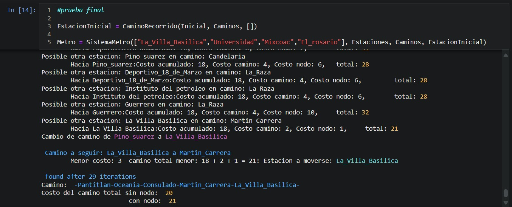

# Practica 2: Algoritmos de busqueda

Universidad Nacional Autónoma de México 
Facultad de Ingeniería 
Inteligencia Artificial 

Práctica 2 

Integrantes:
- Barrera Gomez Támara 
- Juarez valdez Israel 
- Portillo Jaramillo David
- Velasco Pérez Angel David
- Villanueva Pérez Vianey
- Zarco Evandher

## Parte 1: A aplicado a rutas de metro

**Descripción del problema:**
Un turista está visitando una ciudad y quiere encontrar la ruta más rápida entre dos estaciones de metro. Se tiene información sobre las conexiones entre estaciones y una estimación del tiempo de viaje entre ellas.

**Tareas:**
1. Modelar el mapa del metro como un grafo, donde los nodos son estaciones y los arcos representan conexiones con tiempos de viaje.
2. Implementar el algoritmo A para encontrar la mejor ruta entre dos estaciones dadas.
3. Probar el algoritmo con al menos dos pares de estaciones y analizar los resultados.
(probabilidad)

## Prueba del algoritmo

Para la prueba del algoritmo, se tomo todo el sistema de metro y las 4 estaciones objetivo :::::::::::::

el codigo se desarrollo en python y se encuentra dentro de la carpeta Python, tambien se puede acceder a el desde [aqui](./Python/AStar.ipynb).

Es posible modificar la estacion en las que se requiera iniciar al modificar el nombre de la variable estInicialStr dentro de la seccion [Conversion de JsonFile a Datos](./Python/AStar.ipynb#'ConversiondeJsonFileaDatos')

De la misma forma, es posible cambiar las estaciones objetivo 
al modificar la lista de estaciones al crear una instancia de la funcion **SistemaMetro**.

Al utilizar la estacion *pantitlan* como estacion inicial, obtenemos que la estacion mas cercana segun el costo de los caminos y el costo de los nodos es **La villa Basilica** como se puede observar en el codigo y en la siguiente imagen.

