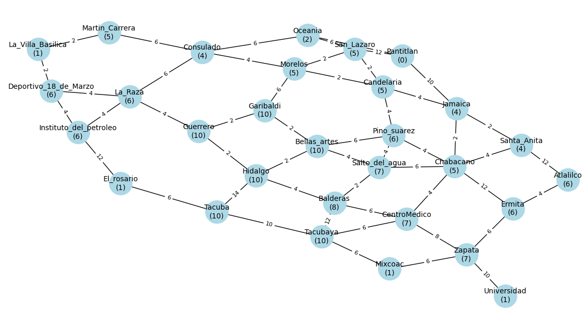
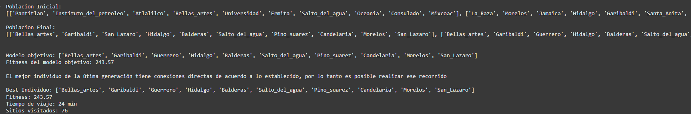

# Practica 2: Algoritmos de busqueda

Universidad Nacional Autónoma de México 
Facultad de Ingeniería 
Inteligencia Artificial 

Práctica 2 

Integrantes:
- Barrera Gomez Támara 
- Juarez valdez Israel 
- Portillo Jaramillo David
- Velasco Pérez Angel David
- Villanueva Pérez Vianey
- Evandher Joel Zarco Hernández

## Parte 1: A aplicado a rutas de metro

### Descripción del problema:
Un turista está visitando una ciudad y quiere encontrar la ruta más rápida entre dos estaciones de metro. Se tiene información sobre las conexiones entre estaciones y una estimación del tiempo de viaje entre ellas.

### Tareas:
1. Modelar el mapa del metro como un grafo, donde los nodos son estaciones y los arcos representan conexiones con tiempos de viaje.
2. Implementar el algoritmo A para encontrar la mejor ruta entre dos estaciones dadas.
3. Probar el algoritmo con al menos dos pares de estaciones y analizar los resultados.
(probabilidad)

### Desarrollo

### Prueba del algoritmo

Para la prueba del algoritmo, se tomo todo el sistema de metro y las 4 estaciones objetivo (El rosario, Mixcoac, Universidad y La villa Basilica)

El codigo se desarrollo en python y se encuentra dentro de la carpeta Python, tambien se puede acceder a el desde [aqui](./Python/AStar.ipynb).

Es posible modificar la estacion en las que se requiera iniciar al modificar el nombre de la variable estInicialStr dentro de la seccion [Conversion de JsonFile a Datos](./Python/AStar.ipynb#'ConversiondeJsonFileaDatos')

De la misma forma, es posible cambiar las estaciones objetivo 
al modificar la lista de estaciones al crear una instancia de la funcion **SistemaMetro**.

Al utilizar la estacion *pantitlan* como estacion inicial, obtenemos que la estacion mas cercana segun el costo de los caminos y el costo de los nodos es **La villa Basilica**, ademas, en la siguiente imagen se pueden observar las estaciones que se recorrieron para llegar a la estacion objetivo, así como el costo total, el recorrido completo de las estaciones recorridas por el codigo se encuentran en el documento.

## Parte 2: Búsqueda por ascenso de colinas en recomendación de películas 
### Descripción del problema: 
Un usuario quiere encontrar la mejor película de acción o terror según sus preferencias (por ejemplo, alta calificación y duración moderada). 

### Tareas: 
1. Representar un conjunto de películas como un espacio de búsqueda, con atributos como calificación IMDB, duración y año de lanzamiento. 
2. Implementar búsqueda por ascenso de colinas para encontrar una película óptima según una función de evaluación (por ejemplo, (calificación - |duración - 120|)). 
3. Probar la implementación con una lista de al menos 10 películas.

### Desarrollo

Para este ejercicio realizamos Investigamos películas de terror, la duración que tenían y las estrellas que habían ganado. El mapa de árbol se fue armando de manera en que las peliculas de mayor duracion fueron nuestras primeras ramas, en este caso **“A”, “D”** e **“I”**, las cuales duraban mas de 2:00:00 horas , porteriormente las peliculas con una duración de película entre 1:50:00 a 2:00:00, las cuales fueron **“B”** y **“E”** ,con una duración de 1:40:00 a 1:50:00 las películas **“C”, “F” y “J”**  y por último las de menor duración que son nuestra solución **“H” y “G”**.
El costo fueron las estrellas qué cada película tiene según *IMDB*.

Primero checamos cuál es tenía el costo más bajo en la primera ramificación y ahí nos dimos cuenta qué fue el nodo “D” para esto de nuestra tabla anotamos los 3 nodos, Posterior checamos el nodo B y E  y escogemos el menor de estos es así que nos vamos con él su ramificación es J, y posteriormente la ramificación de J es G llevándonos a la primera solución. En este caso cuando queremos ir a la segunda solución nos tenemos que desplazar otra vez hasta la primera ramificación y el menor es I posteriormente vemos que y lleva igualmente a él ramificación que ya habíamos visto entonces nos regresamos al Nodo A posteriormente al B posteriormente, el B cuenta con 2 ramificaciones y el menor es F y  la última ramificación es **H** llegando así a nuestra solución 2

## Parte 3: Algoritmos Genéticos para Optimización de Rutas de Metro
### Descripción del problema
Se busca encontrar la mejor combinación de estaciones para optimizar una ruta turística en metro, maximizando la cantidad de sitios visitados en un tiempo determinado.

### Tareas
1. Representar una ruta en metro como un cromosoma (lista de estaciones en un orden determinado).
2. Definir una función de aptitud basada en el tiempo de viaje y la cantidad de sitios visitados.
3. Implementar un algoritmo genético con selección, cruza y mutación para encontrar la mejor ruta.
4. Probar el algoritmo con un conjunto de 10 estaciones y analizar los resultados.

### Implementación
El algoritmo genético se implementó en Python utilizando el framework de Google Colab. El código se encuentra en la carpeta Python y se llama Práctica2_AlgoritmoGen.ipynb, tambien se puede acceder a el desde [aqui](./Python/Práctica2_AlgoritmoGen.ipynb).

Se tomo el sistema del metro representado en el siguiente grafo:

### Análisis de Resultados
En la siguiente imagen podemos ver los resultados tras 300 iteraciones, tenemos un rendimiento prácticamente excelente, también se puede visualizar un poco de la población inicial y final.

La siguiente imagen es la representación gráfica del rendimiento promedio de los individuos tras realizar 300 iteraciones, vemos que en la parte final, el mejor individuo de la población alcanza el fitness esperado.

Nuestro análisis de resultados se basará en la gráfica "Average Fitness vs Iterations", que se muestra a continuación, para el cuál se realizaron 1000 iteraciones:

**Interpretación de la gráfica:**

La gráfica muestra la evolución del fitness promedio de la población a lo largo de las generaciones. Se observa que el fitness promedio aumenta con el tiempo y tiende a estabilizarse en un valor, lo que indica que el algoritmo está convergiendo hacia una solución óptima.

**Observaciones:**

* **Convergencia:** El algoritmo converge relativamente rápido en las primeras iteraciones, lo que sugiere que la función de fitness y los operadores genéticos son efectivos para encontrar buenas soluciones.
* **Estabilidad:** Después de un cierto número de iteraciones, el fitness promedio tiende hacia ciertos valores, lo que indica que el algoritmo ha encontrado una solución óptima o cercana al óptimo.
* **Fitness del mejor individuo:** 243.57. Este valor es el esperado en comparación con el fitness del modelo objetivo, lo que indica que el algoritmo ha encontrado una buena solución.
* **Tiempo de viaje y sitios visitados:** Se encontró una solución que permite visitar **76 sitios turísticos** en **24 minutos**. Estos valores indican que el mejor individuo **cumple** con los criterios solicitados.

#### Conclusiones

* El algoritmo genético es efectivo para la optimización de rutas de metro.
* La función de fitness y los operadores genéticos utilizados son adecuados para el problema.
* El algoritmo converge hacia una solución óptima o cercana al óptimo.
* El mejor individuo encontrado representa una buena solución al problema.
